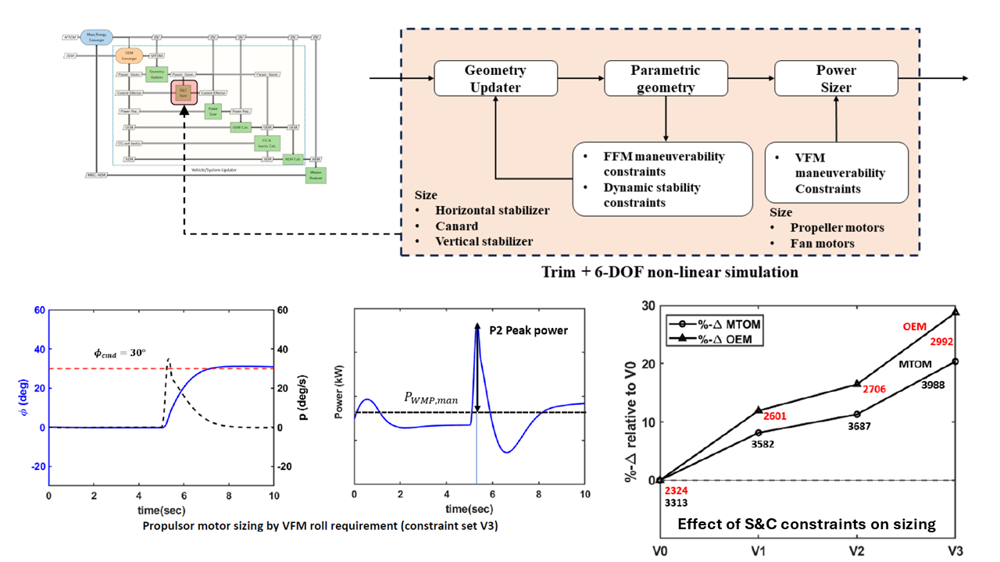

# Introduction
I am Aashutosh Aman Mishra, a Ph.D. candidate in Aerospace Engineering at Auburn University, graduating in May 2025. 

My expertise includes aircraft design, aero-propulsive model development, flight dynamics, flight control system development, and real-time flight simulation, with a focus on novel/unconventional advanced air mobility concepts. 

My research goal is to develop a **_unified sizing and flight simulation framework_** to ensure that the vehicle is sized to exhibit desirable flying qualities during flight. 

[Download My Resume](https://github.com/EverestAU/EverestAU.github.io/raw/main/resume.pdf)

# Areas of Specialization

# Education
- Ph.D., Aerospace Engineering | Auburn University (_May 2025_)
- M.Sc. Aerospace Engineering | Auburn University (_May 2023_)
- B.E., Mechanical Engineering | Tribhuvan University (_November 2017_)

# Experience
**Graduate Research Assistant, Auburn University (_August 2019 - Present_)**
<figure>
<video width="250" height="340" controls poster="background-image.jpg">
  <source src="ResearchIntro_2.mp4" type="video/mp4">  
</video>
  <figcaption>Research Summary Video.</figcaption>
</figure>

- Developed generalized tools for rapid vehicle design, aircraft sizing, and real-time flight simulation for conventional as well as novel advanced air mobility configurations, including fuel-burning, all-electric, and hybrid-electric aircraft.
   
- Integrated vortex-lattice and panel codes for aerodynamic prediction within the aircraft sizing and flight simulation framework in an optimal way to support real-time flight simulation.

- Implemented a strip-theory based modeling approach to tackle coupled aero-propulsive interactions and validated them with CFD-generated and wind tunnel results.

- Integrated aircraft longitudinal and lateral-directional flight dynamic characteristics, based on a fully nonlinear 6-DOF flight simulation model to meet the handling qualities guidelines defined by MIL-STD-1797A and MIL-F-8785C for fixed-wing aircraft and ADS-33E-PRF for rotary-wing aircraft during vehicle sizing.

- Led the development, integration, and validation of aero-propulsive characteristics for novel eVTOL designs into the research flight simulators driven by a MATLAB/Simulink-based non-linear time domain simulation framework.

- Gained hands-on experience with flight simulator construction, flight control system development, cockpit displays and control setup, visualization setup, and model calibration, to facilitate flight simulator operation.

- Tutored aircraft design tools like OpenVSP, XFOIL, QMIL/QPROP, and CFD (FlightStream®) to the aircraft design class.

# [Projects](https://www.vsddl.com/projects/)
- **Aircraft sizing and performance analysis framework: _Parametric Energy-Based Aircraft Configuration Evaluator_** [_PEACE_](https://www.linkedin.com/pulse/peace-vsddls-aircraft-sizing-framework-vsddl-8jxse/?trackingId=5FJjuBf9U6oFSzaJxECuzg%3D%3D)
  

  Following are some of the conceptual vehicles sized using PEACE:  
  More details are available here on the lab's [website](https://www.vsddl.com/hangar/).    
  
  
      
  
  References:
  1. I. Chakraborty and A. A. Mishra, “Sizing and analysis of a lift-plus-cruise aircraft with electrified propulsion,” Journal of Aircraft, pp. 1–19, 2022. [DOI](https://doi.org/10.2514/1.C037044).
  2. R. Bhandari, A. A. Mishra, and I. Chakraborty, “Optimization of lift-plus-cruise vertical take-off and landing aircraft with electrified propulsion,” Journal of Aircraft, pp. 1–23, 2024. [DOI](https://doi.org/10.2514/1.C037343).
  
  
    
  
  
References:
1. A. A. Mishra, and I. Chakraborty, “Integrating Stability and Control Constraints into the Conceptual Sizing of a VTOL Tilt-Wing Aircraft,”
   AIAA AVIATION FORUM AND ASCEND 2024, AIAA-2024-4050, Las Vegas, NV. [DOI](https://doi.org/10.2514/6.2024-4050).
2. A. A. Mishra and I. Chakraborty, “Integrating stability and control considerations into the sizing of an
advanced air mobility VTOL aircraft,” in AIAA SCITECH 2024 Forum, AIAA-2024-2316, Orlando, FL. [DOI](https://doi.org/10.2514/6.2024-2316).

  

- **Stability and Control Assessment and Flight Simulation Framework: _Modular Aircraft Dynamics and Control Algorithm Simulation Platform (MADCASP)_**
  
  
  
  
  <figure>
  <video width="250" height="340" controls poster="FlightSim_Background.jpg">
    <source src="FlightSimDemo3.mp4" type="video/mp4">  
  </video>
    <figcaption>LPC-03 "Phoenix" Flight.</figcaption>
  </figure>

- Unified Vehicle Sizing and Flight Simulation Framework (_connecting the dots_)  
  

  My goal is to connect the aircraft design and flight dynamics together to achieve a flight vehicle that exhibits desirable "flying qualities" during piloted/automated flight.

 

# Awards and Achievements
[AIAA Orville and Wilbur Wright Graduate Award (2024)](https://aerospaceamerica.aiaa.org/bulletin/september-2024-aiaa-bulletin/)  
Excerpt from Aerospace America 2024 September bulletin:  

[AIAA Luis de Florez Graduate Award in Flight Simulation (2022)](https://digitaleditions.walsworth.com/publication/?i=759268&article_id=4332792&view=articleBrowser)  
Excerpt from Aerospace America 2022 September bulletin:  

[AIAA Electrified Aircraft Technology Best Paper Award (2022)](https://aerospaceamerica.aiaa.org/bulletin/november-2023-aiaa-bulletin/)  

  
[AIAA Aircraft Design Best Paper Award (2021)](https://aerospaceamerica.aiaa.org/bulletin/november-2021-aiaa-bulletin/)  

# Conference Publications

1. A. A. Mishra, and I. Chakraborty, “Integrating Stability and Control Constraints into the Conceptual Sizing of a VTOL Tilt-Wing Aircraft,”
   AIAA AVIATION FORUM AND ASCEND 2024, AIAA-2024-4050, Las Vegas, NV. [DOI](https://doi.org/10.2514/6.2024-4050).

2. A. A. Mishra and I. Chakraborty, “Integrating stability and control considerations into the sizing of an
advanced air mobility VTOL aircraft,” in AIAA SCITECH 2024 Forum, AIAA-2024-2316, Orlando, FL. [DOI](https://doi.org/10.2514/6.2024-2316).
      
3. I. Chakraborty, A. A. Mishra, A. M. Comer, and C. Leonard, “Total energy based flight control system
design for a lift-plus-cruise urban air mobility concept,” in AIAA SCITECH 2021 Forum,
AIAA-2021-1899, Virtual, 2021, p. 1899. [DOI](https://doi.org/10.2514/6.2021-1899).

4. I. Chakraborty, A. M. Comer, A. A. Mishra, J. M. Dewey, and C. Leonard, “A reconfigurable flight
simulation framework aimed at novel flight vehicle concepts,” in AIAA AVIATION 2020 FORUM,
AIAA-2020-3190, Virtual, 2020, p. 3190. [DOI](https://doi.org/10.2514/6.2020-3190).
   

# Journal Publications   
1. R. Bhandari, A. A. Mishra, and I. Chakraborty, “Optimization of lift-plus-cruise vertical take-off and
landing aircraft with electrified propulsion,” Journal of Aircraft, pp. 1–23, 2024. [DOI](https://doi.org/10.2514/1.C037343).
       
2. I. Chakraborty and A. A. Mishra, “Sizing of tilt-wing aircraft with all-electric and hybrid-electric
propulsion,” Journal of Aircraft, vol. 60, no. 1, pp. 245–264, 2023. [DOI](https://doi.org/10.2514/1.C036813).

3. I. Chakraborty, A. A. Mishra, D. van Dommelen, and W. A. Anemaat, “Design and sizing of an
electrified lift-plus-cruise ducted fan aircraft,” Journal of Aircraft, vol. 60, no. 3, pp. 817–834, 2023. [DOI](https://doi.org/10.2514/1.C036811).

4. I. Chakraborty and A. A. Mishra, “Sizing and analysis of a lift-plus-cruise aircraft with electrified
propulsion,” Journal of Aircraft, pp. 1–19, 2022. [DOI](https://doi.org/10.2514/1.C037044).

5. I. Chakraborty and A. A. Mishra, “Generalized energy-based flight vehicle sizing and performance
analysis methodology,” Journal of Aircraft, vol. 58, no. 4, pp. 762–780, 2021. [DOI](https://doi.org/10.2514/1.C036101).

# References
1. Dr. Imon Chakraborty [LinkedIn](https://www.linkedin.com/in/imon-chakraborty/)  
Title: Associate Professor, Aerospace Engineering ([Website]((https://eng.auburn.edu/directory/izc0018)))  
Organization: Auburn University  
Email: imonchakraborty@auburn.edu  
Phone: (334) 844-4874  
Relationship: Ph.D. Advisor   

2. Dr. Roy Hartfield  [LinkedIn](https://www.linkedin.com/in/roy-hartfield-16b4141a/)  
Title: Professor, Aerospace Engineering ([Website](https://eng.auburn.edu/directory/hartfrj))  
Organization: Auburn University  
Email: hartfrj@auburn.edu  
Phone: (334) 844-6819  
Relationship: Ph.D. Committee Member and Mentor  

3. Dr. Vivek Ahuja [LinkedIn](https://www.linkedin.com/in/vivekahuja2013/)  
Title: Chief Executive Officer  
Organization: Research in Flight ([Website](https://researchinflight.com/))  
Email: vivek.ahuja@researchinflight.com  
Phone: (334) 332-6078  
Relationship: Mentor (worked together on aerodynamic model development in FlightStream®)  

5. Dr. Sudip Bhattrai [LinkedIn](https://www.linkedin.com/in/sudip-bhattrai-99588540/)   
Title: Department Chair, Department of Mechanical and Aerospace Engineering ([Website](https://mech.pcampus.edu.np/our-people/sudip-bhattrai/))  
Organization: IOE Pulchowk Campus, Tribhuvan University, Nepal  
Email: sudip@pcampus.edu.np  
Phone: +977-9866925296  
Relationship: Undergraduate research supervisor  

Connect with me here:  

 

